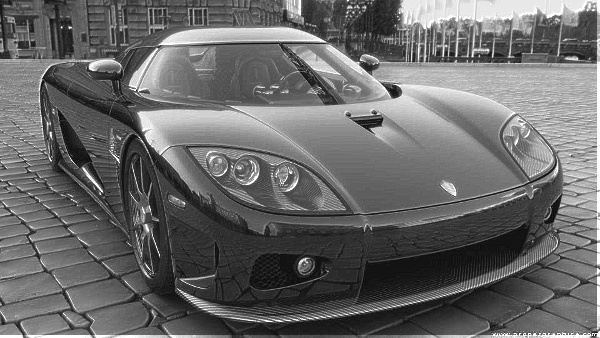
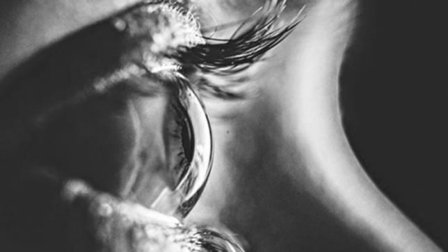
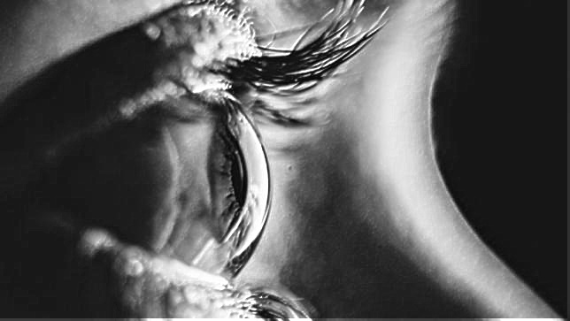
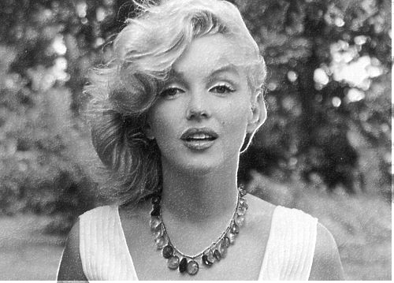
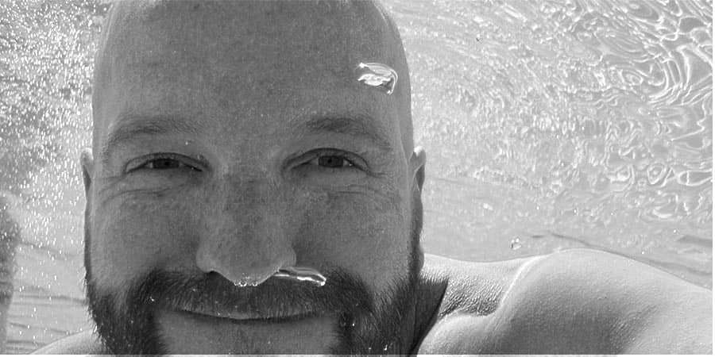

# PhotoEnhance
This program takes a photo and enhances it by edge enhancement and equalization.

$ make           
g++ photo_enhance.cpp image_processing.cpp -Ofast -fPIC -Wall -std=c++0x -I./ `pkg-config opencv --cflags`   -o  photo_enhance `pkg-config opencv --libs` 

$ ./photo_enhance TestInput.jpg           
Input size is 1024x683          
input file is TestInput.jpg output file is out.jpg         
Sharpness before enhance = 361         
Sharpness after  enhance = 478         

